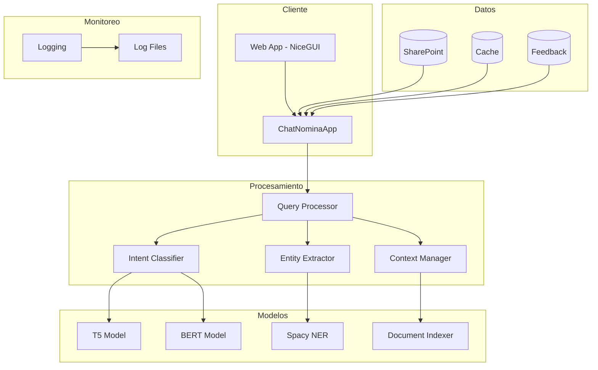
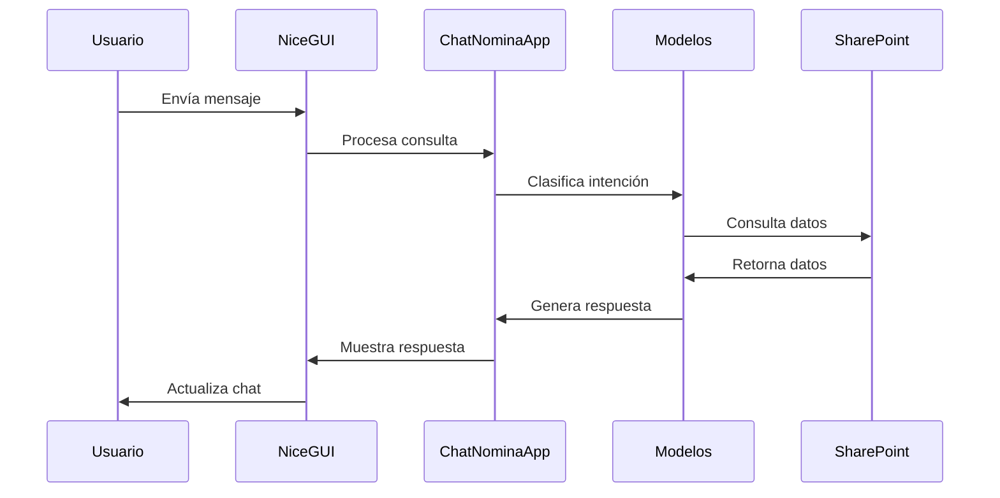
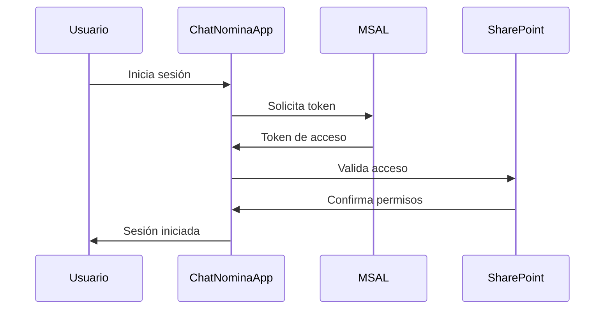

# ANEXO A: ARQUITECTURA DEL SISTEMA

## A.1 Visión General

ChatNomina es un sistema de chatbot inteligente diseñado para manejar consultas sobre nómina, implementado como una aplicación monolítica usando NiceGUI y modelos de lenguaje natural. El sistema está diseñado para proporcionar respuestas precisas y contextuales a las consultas de los usuarios, con una integración directa con SharePoint para el acceso a datos de nómina.

### A.1.1 Objetivos de la Arquitectura

1. **Mantenibilidad**: La arquitectura debe facilitar la actualización y mantenimiento del sistema.
2. **Seguridad**: Protección de datos sensibles de nómina y autenticación robusta con Azure AD.
3. **Rendimiento**: Respuestas rápidas y precisas a las consultas de los usuarios.
4. **Confiabilidad**: Alta disponibilidad y manejo robusto de errores.

### A.1.2 Decisiones Arquitectónicas Clave

1. **Elección de NiceGUI**:
   - Justificación: Permite desarrollo rápido de interfaces web con Python
   - Ventajas: Integración nativa con el backend Python, componentes modernos
   - Consideraciones: Rendimiento en clientes pesados

2. **Integración con SharePoint**:
   - Justificación: Aprovechamiento de la infraestructura existente
   - Ventajas: Datos centralizados, permisos integrados
   - Consideraciones: Latencia en consultas, dependencia de servicios externos

3. **Arquitectura Monolítica**:
   - Justificación: Simplicidad en el desarrollo y despliegue
   - Ventajas: Fácil mantenimiento, menor complejidad
   - Consideraciones: Escalabilidad limitada

## A.2 Diagrama de Arquitectura



### A.2.1 Explicación del Diagrama

El diagrama muestra la arquitectura en capas:

1. **Capa de Cliente**:
   - Interfaz web única (NiceGUI)
   - Manejo de estado local
   - Componentes de UI interactivos

2. **Capa de Procesamiento**:
   - Pipeline de NLP
   - Modelos de IA (T5 y BERT)
   - Gestión de contexto

3. **Capa de Datos**:
   - Integración SharePoint
   - Caché local
   - Almacenamiento de feedback

4. **Capa de Monitoreo**:
   - Logging a archivos
   - Rotación de logs

## A.3 Componentes Principales

### A.3.1 Cliente

#### Web Application (NiceGUI)

La aplicación web está construida con NiceGUI, un framework que permite crear interfaces web interactivas usando Python.

**Características Principales**:
1. **Interfaz de Usuario**:
   - Diseño responsivo
   - Componentes interactivos (chat, formularios)
   - Sistema de temas
   - Implementación real:
     ```python
     from nicegui import ui
     
     @ui.page('/')
     def main():
         with ui.card().classes('w-full max-w-2xl mx-auto'):
             ui.label('ChatNomina').classes('text-2xl font-bold')
             chat = ui.chat().classes('w-full')
             input = ui.input(placeholder='Escribe tu consulta...')
             ui.button('Enviar', on_click=lambda: process_message(input.value))
     ```

2. **Gestión de Estado**:
   - Estado local para UI
   - Persistencia de sesión
   - Implementación real:
     ```python
     class ChatNominaApp:
         def __init__(self):
             self.messages = []
             self.documento_usuario = None
             self.access_token = None
             self.txt_cache = {}
             self.word_docs = {}
     ```

### A.3.2 Procesamiento

#### Query Processor

El procesador de consultas es responsable de analizar y entender las preguntas de los usuarios.

**Componentes Principales**:
1. **Modelos de IA**:
   - T5 para generación de respuestas
   - BERT para clasificación
   - Implementación real:
     ```python
     def _cargar_modelos(self):
         self.model_t5 = T5ForConditionalGeneration.from_pretrained(
             self.MODELO_DIR,
             device_map="cpu",
             torch_dtype=torch.float32
         )
         self.bert_model = AutoModelForSequenceClassification.from_pretrained(
             os.path.join(self.MODELO_DIR, "bert_model"),
             num_labels=3
         )
     ```

2. **Clasificación de Intención**:
   - Modelo BERT
   - Categorías predefinidas
   - Implementación real:
     ```python
     def _clasificar_pregunta(self, pregunta: str) -> Tuple[str, float]:
         # Clasificación usando BERT
         inputs = self.bert_tokenizer(
             pregunta,
             return_tensors="pt",
             truncation=True,
             max_length=512
         )
         outputs = self.bert_model(**inputs)
         return self._interpretar_clasificacion(outputs)
     ```

### A.3.3 Almacenamiento

#### SharePoint Integration

La integración con SharePoint es crucial para acceder a los datos de nómina.

**Características Principales**:
1. **Conexión y Autenticación**:
   - Autenticación con MSAL
   - Manejo de tokens
   - Implementación real:
     ```python
     def __init__(self):
         self.app = PublicClientApplication(
             client_id=self.CLIENT_ID,
             authority=self.AUTHORITY
         )
         self.SITE_ID = os.getenv("SITE_ID")
         self.DRIVE_ID = os.getenv("DRIVE_ID")
     ```

2. **Caché y Sincronización**:
   - Caché en memoria
   - Carga de documentos
   - Implementación real:
     ```python
     async def cargar_documentos(self):
         self.txt_cache = await cargar_archivos_txt_desde_sharepoint()
         self.word_docs = await cargar_documentos_word_desde_sharepoint()
     ```

### A.3.4 Monitoreo

#### Sistema de Logging

El sistema de logging es crucial para el monitoreo y debugging.

**Características Principales**:
1. **Logging Estructurado**:
   - Formato detallado
   - Rotación de archivos
   - Implementación real:
     ```python
     # Configuración de logging
     log_dir = BASE_DIR / "logs"
     log_file_path = log_dir / "app.log"
     
     file_handler = logging.handlers.RotatingFileHandler(
         log_file_path,
         maxBytes=10*1024*1024,  # 10MB
         backupCount=5,
         encoding='utf-8'
     )
     ```

## A.4 Flujos de Datos

### A.4.1 Flujo de Chat



### A.4.2 Flujo de Autenticación



## A.5 Consideraciones Técnicas

### A.5.1 Detalles de Implementación

1. **Rendimiento**:
   - Caché de documentos
   - Modelos optimizados para CPU
   - Implementación real:
     ```python
     # Caché de documentos
     self.txt_cache = {}
     self.word_docs = {}
     
     # Optimización de modelos
     self.model_t5 = T5ForConditionalGeneration.from_pretrained(
         self.MODELO_DIR,
         device_map="cpu",
         torch_dtype=torch.float32
     )
     ```

2. **Seguridad**:
   - Autenticación Azure AD
   - Validación de entrada
   - Implementación real:
     ```python
     # Autenticación
     self.app = PublicClientApplication(
         client_id=self.CLIENT_ID,
         authority=self.AUTHORITY
     )
     
     # Validación
     def _es_respuesta_invalida(self, pregunta: str, respuesta: str) -> bool:
         return len(respuesta) < 10 or respuesta.startswith("Lo siento")
     ```

3. **Mantenimiento**:
   - Logging detallado
   - Sistema de feedback
   - Implementación real:
     ```python
     def manejar_feedback(self, pregunta: str, respuesta: str, es_util: bool):
         if not es_util:
             self.guardar_feedback(
                 pregunta,
                 respuesta,
                 "Respuesta marcada como no útil",
                 None
             )
     ```
