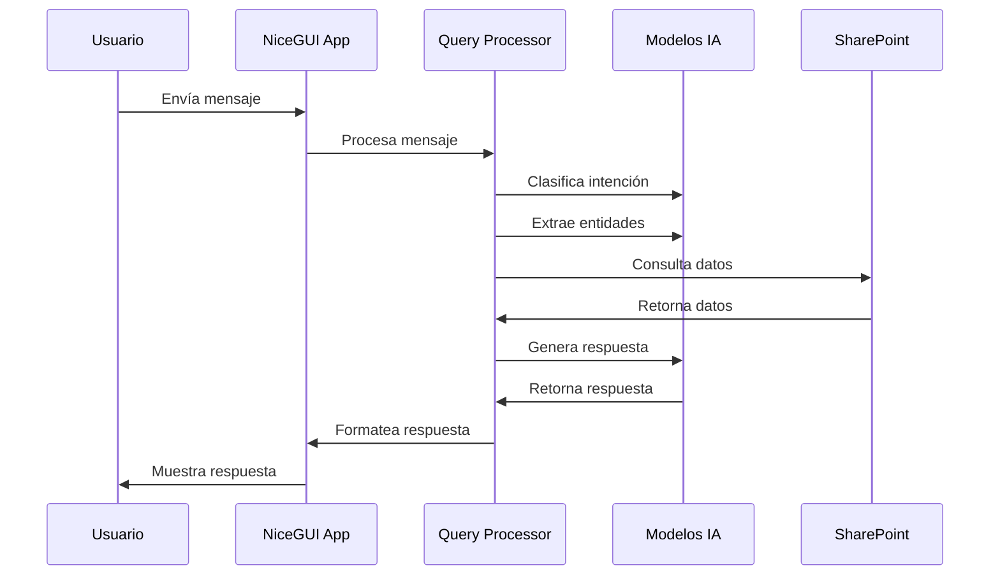
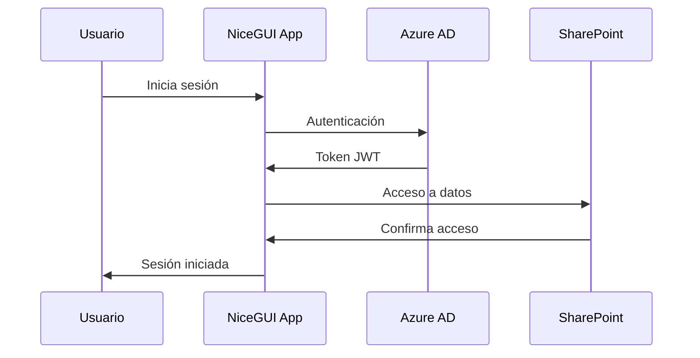

# Anexo B: Implementación Técnica - ChatNomina

## 1. Visión General de la Implementación

ChatNomina fue implementado como una aplicación monolítica utilizando NiceGUI, un framework moderno para crear interfaces web interactivas con Python. El sistema está diseñado para proporcionar respuestas precisas y contextuales a las consultas de nómina, con una integración directa con SharePoint para el acceso a datos.

## 2. Stack Tecnológico

### 2.1 Frontend y Backend (Monolítico)

- **Framework Principal**: NiceGUI
- **Lenguaje**: Python 3.8+
- **Gestión de Estado**: Estado local en Python
- **UI Components**: Componentes nativos de NiceGUI
- **Estilos**: Tailwind CSS
- **Testing**: Pytest
- **Build Tool**: Poetry

### 2.2 Modelos de IA

- **Framework**: PyTorch
- **Modelos Base**:
  - T5-small para generación de respuestas
  - BERT para clasificación de intención
  - Spacy para extracción de entidades
- **Procesamiento**: Hugging Face Transformers
- **Vectorización**: Sentence Transformers

### 2.3 Integración de Datos

- **SharePoint**: Microsoft Graph API
- **Autenticación**: Azure AD
- **Caché**: Sistema de caché en memoria
- **Almacenamiento**: Archivos locales y SharePoint

## 3. Componentes Principales

### 3.1 Aplicación Principal

```python
class ChatNominaApp:
    def __init__(self):
        self.messages = []
        self.documento_usuario = None
        self.access_token = None
        self.txt_cache = {}
        self.word_docs = {}
        self._cargar_modelos()
        self._inicializar_sharepoint()
```

### 3.2 Procesamiento de Consultas

```python
class QueryProcessor:
    def __init__(self):
        self.model_t5 = None
        self.bert_model = None
        self.nlp = None
      
    def _cargar_modelos(self):
        self.model_t5 = T5ForConditionalGeneration.from_pretrained(
            self.MODELO_DIR,
            device_map="cpu",
            torch_dtype=torch.float32
        )
        self.bert_model = AutoModelForSequenceClassification.from_pretrained(
            os.path.join(self.MODELO_DIR, "bert_model"),
            num_labels=3
        )
```

## 4. Flujos de Datos

### 4.1 Procesamiento de Mensajes



### 4.2 Autenticación



## 5. Consideraciones de Implementación

### 5.1 Seguridad

- Autenticación con Azure AD
- Tokens JWT para sesiones
- Validación de entrada en todas las consultas
- Sanitización de datos
- Auditoría de accesos
- Protección de datos sensibles

### 5.2 Rendimiento

- Caché en memoria para datos frecuentes
- Optimización de consultas a SharePoint
- Procesamiento asíncrono de mensajes
- Lazy loading de modelos
- Indexación de documentos

### 5.3 Mantenibilidad

- Código modular y bien documentado
- Tests automatizados
- Logging centralizado
- Documentación actualizada
- Versionado semántico

## 6. Métricas y Monitoreo

### 6.1 Métricas Clave

- Latencia de respuesta (< 2s)
- Tasa de acierto del modelo (> 85%)
- Uso de memoria (< 2GB)
- Tiempo de respuesta del chat (< 3s)
- Tasa de satisfacción de usuarios (> 4/5)

### 6.2 Monitoreo

- Logging a archivos
- Rotación de logs
- Métricas de uso
- Monitoreo de errores
- Feedback de usuarios

## 7. Pruebas

### 7.1 Tipos de Pruebas

- Unitarias (pytest)
- Integración (pytest)
- End-to-end (pytest + Selenium)
- Carga (locust)
- Seguridad (OWASP ZAP)

### 7.2 Cobertura

- Código: > 70%
- Modelos: > 80%
- UI: > 75%

## 8. Despliegue

### 8.1 Ambiente

- Desarrollo local
- Producción (servidor Windows)

### 8.2 Proceso de Despliegue

1. Actualización de código
2. Ejecución de pruebas
3. Backup de datos
4. Despliegue de cambios
5. Verificación post-despliegue

## 9. Mantenimiento

### 9.1 Actualizaciones

- Parches de seguridad mensuales
- Actualizaciones de dependencias trimestrales
- Mejoras de modelos semestrales
- Nuevas características según roadmap

### 9.2 Backup

- Datos de SharePoint: Automático
- Configuración: En cada cambio
- Logs: Diario
- Modelos: Semanal

### 9.3 Recuperación

- Restauración desde SharePoint
- Procedimientos de rollback
- Plan de contingencia

## 10. Consideraciones Futuras

### 10.1 Mejoras Técnicas

- Optimización de modelos
- Mejora de caché
- Internacionalización
- Nuevas integraciones
- Análisis avanzado

### 10.2 Escalabilidad

- Mejora de rendimiento
- Nuevas funcionalidades
- Integración con más sistemas
- Análisis predictivo
- Personalización avanzada
