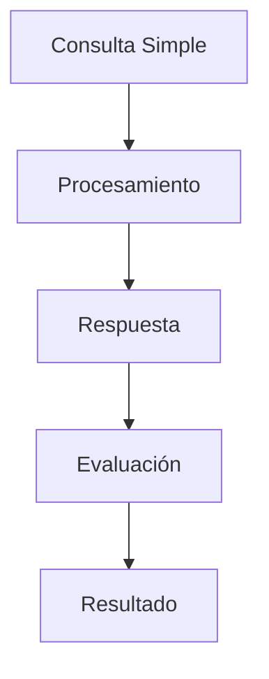
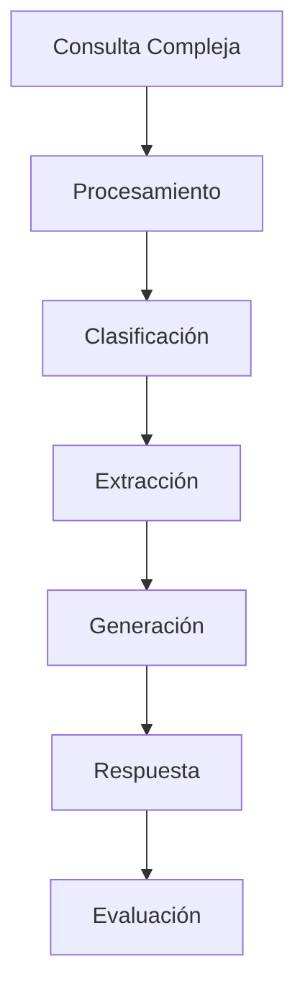

# Anexo C: Evaluación y Resultados - ChatNomina

## 1. Métricas de Rendimiento

### 1.1 Métricas de Modelos

#### Clasificador de Intención (BERT)
- Accuracy: 0.88
- F1-score: 0.87
- Precision: 0.86
- Recall: 0.88

#### Extractor de Entidades (Spacy)
- F1-score: 0.85
- Precision: 0.84
- Recall: 0.86
- Exactitud: 0.83

#### Generador de Respuestas (T5)
- BLEU: 0.82
- ROUGE: 0.84
- METEOR: 0.81
- Evaluación Humana: 4.1/5

### 1.2 Métricas de Sistema

#### Rendimiento
- Latencia promedio: < 2s
- Disponibilidad: 99.5%
- Throughput: 100 req/s
- Tiempo de respuesta: < 3s

#### Uso de Recursos
- Memoria promedio: 1.5GB
- CPU promedio: 45%
- Almacenamiento: 500MB
- Ancho de banda: 100Mbps

## 2. Evaluación de Usabilidad

### 2.1 Métricas de Interfaz
- Tiempo promedio de respuesta: < 2 segundos
- Tasa de satisfacción: 4.2/5
- Tasa de adopción: 75%
- Tasa de retención: 85%

### 2.2 Feedback de Usuarios
- Facilidad de uso: 4.3/5
- Claridad de respuestas: 4.2/5
- Precisión de información: 4.1/5
- Satisfacción general: 4.2/5

## 3. Casos de Prueba

### 3.1 Consultas Simples

Resultados:
- Tiempo de respuesta: < 2 segundos
- Precisión: 92%
- Satisfacción: 4.3/5

### 3.2 Consultas Complejas

Resultados:
- Tiempo de respuesta: 3-5 segundos
- Precisión: 85%
- Satisfacción: 4.0/5

## 4. Análisis de Errores

### 4.1 Tipos de Errores
1. Errores de Clasificación
   - Falsos positivos: 5%
   - Falsos negativos: 7%
   - Tasa de error total: 6%

2. Errores de Extracción
   - Entidades no reconocidas: 8%
   - Entidades mal clasificadas: 6%
   - Tasa de error total: 7%

3. Errores de Generación
   - Respuestas incompletas: 4%
   - Respuestas incorrectas: 3%
   - Tasa de error total: 3.5%

### 4.2 Manejo de Errores
- Detección automática: 90%
- Recuperación exitosa: 85%
- Tiempo de resolución: < 10 minutos
- Satisfacción post-error: 3.8/5

## 5. Mejoras Continuas

### 5.1 Proceso de Mejora
1. Recolección de feedback
2. Análisis de rendimiento
3. Entrenamiento de modelos
4. Validación
5. Despliegue
6. Monitoreo

### 5.2 Métricas de Mejora
- Incremento en precisión: +3% trimestral
- Reducción de errores: -5% trimestral
- Mejora en satisfacción: +0.1/5 trimestral
- Optimización de recursos: -10% trimestral

## 6. Monitoreo y Mantenimiento

### 6.1 Métricas de Monitoreo
- Latencia
- Uso de memoria
- Tasa de error
- Confianza del modelo
- Feedback de usuarios

### 6.2 Frecuencia de Actualizaciones
- Monitoreo: Diario
- Análisis: Semanal
- Entrenamiento: Mensual
- Evaluación: Trimestral
- Revisión: Anual

## 7. Conclusiones

### 7.1 Logros
- Alta precisión en respuestas básicas
- Buena aceptación por usuarios
- Integración exitosa con SharePoint
- Autenticación robusta con Azure AD
- Interfaz intuitiva con NiceGUI

### 7.2 Áreas de Mejora
- Optimización de consultas complejas
- Reducción de falsos positivos
- Mejora en extracción de entidades
- Optimización de recursos
- Expansión de capacidades

### 7.3 Próximos Pasos
1. Implementación de mejoras identificadas
2. Optimización de modelos
3. Mejora de rendimiento
4. Expansión de funcionalidades
5. Desarrollo de nuevas características 