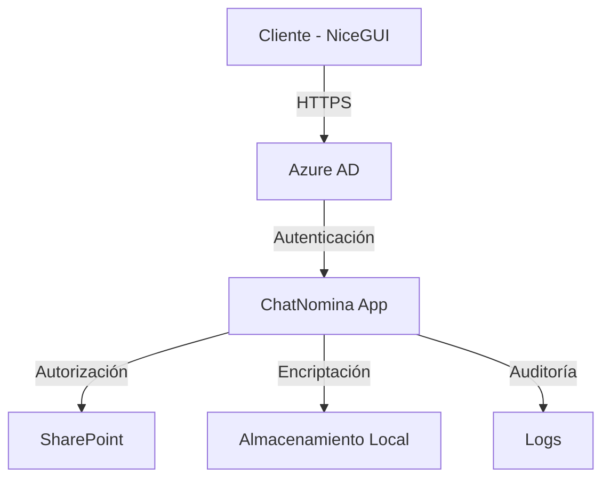

# Anexo D: Seguridad y Privacidad - ChatNomina

## 1. Arquitectura de Seguridad

### 1.1 Capas de Seguridad

### 1.2 Componentes Principales

- Azure AD para autenticación
- SharePoint para datos
- Aplicación NiceGUI
- Sistema de Logs
- Sistema de Backup
- Caché local

## 2. Autenticación y Autorización

### 2.1 Métodos de Autenticación

- Autenticación con Azure AD
- Integración con Microsoft 365
- Tokens JWT para sesiones
- Single Sign-On (SSO)

### 2.2 Gestión de Sesiones

- Tokens de corta duración (1 hora)
- Refresh tokens de larga duración (24 horas)
- Revocación de sesiones
- Detección de sesiones concurrentes

### 2.3 Políticas de Contraseñas (TENANT 365 Universidad)

- Mínimo 8 caracteres
- Requiere mayúsculas y minúsculas
- Requiere números
- Requiere caracteres especiales
- Cambio obligatorio cada 90 días
- Historial de contraseñas (últimas 5)

### 2.4 Roles y Permisos

- Administrador
  - Gestión completa del sistema
  - Administración de usuarios
  - Configuración de seguridad
- Usuario
  - Consulta de información personal
  - Gestión de preferencias
- Auditor
  - Visualización de logs
  - Reportes de seguridad
- Soporte
  - Asistencia a usuarios
  - Gestión de incidencias

## 3. Protección de Datos

### 3.1 Encriptación

- En tránsito
  - TLS 1.3 para comunicaciones
  - Certificados SSL/TLS
  - Perfect Forward Secrecy
- En reposo
  - Encriptación de datos sensibles
  - Protección de archivos locales
  - Seguridad de SharePoint

### 3.2 Datos Sensibles

- Información personal
  - Datos de identificación
  - Información de contacto
  - Datos bancarios
- Datos de nómina
  - Salarios
  - Deducciones
  - Bonificaciones
- Historial de transacciones
  - Consultas realizadas
  - Respuestas generadas
  - Feedback de usuarios

### 3.3 Manejo de Datos

- Minimización de datos
  - Solo se almacena lo necesario
  - Anonimización cuando sea posible
  - Retención limitada
- Retención de datos
  - Políticas de retención definidas
  - Eliminación automática
  - Archivo seguro
- Eliminación segura
  - Borrado definitivo
  - Verificación de eliminación
  - Registro de eliminación

## 4. Seguridad de la Aplicación

### 4.1 Protección contra Ataques

- SQL Injection
  - Validación de entrada
  - Sanitización de datos
  - Parámetros seguros
- XSS (Cross-Site Scripting)
  - Escapado de HTML
  - Content Security Policy
  - Validación de entrada
- CSRF (Cross-Site Request Forgery)
  - Tokens CSRF
  - Validación de origen
  - SameSite cookies
- Ataques de fuerza bruta
  - Rate limiting
  - Bloqueo temporal
  - Detección de patrones

### 4.2 Headers de Seguridad

- Content-Security-Policy
- X-Frame-Options
- X-Content-Type-Options
- Strict-Transport-Security
- X-XSS-Protection

### 4.3 Validación de Entrada

- Sanitización de datos
- Validación de tipos
- Validación de rangos
- Validación de formato

## 5. Monitoreo y Auditoría

### 5.1 Sistema de Logs

- Logs de autenticación
  - Intentos de inicio de sesión
  - Cambios de contraseña
  - Revocación de tokens
- Logs de autorización
  - Accesos a recursos
  - Cambios de permisos
  - Violaciones de acceso
- Logs de operaciones
  - Consultas realizadas
  - Respuestas generadas
  - Errores del sistema
- Logs de sistema
  - Estado de servicios
  - Rendimiento
  - Errores técnicos

### 5.2 Monitoreo

- Detección de anomalías
  - Patrones de acceso
  - Comportamiento de usuarios
  - Uso de recursos
- Monitoreo de rendimiento
  - Tiempo de respuesta
  - Uso de CPU/Memoria
  - Latencia de red
- Alertas de seguridad
  - Intentos de intrusión
  - Comportamiento sospechoso
  - Errores críticos

### 5.3 Auditoría

- Registro de cambios
  - Modificaciones de datos
  - Cambios de configuración
  - Actualizaciones del sistema
- Registro de accesos
  - Accesos a recursos
  - Consultas realizadas
  - Exportaciones de datos
- Registro de errores
  - Errores de autenticación
  - Errores de autorización
  - Errores del sistema

## 6. Respuesta a Incidentes

### 6.1 Plan de Respuesta

- Identificación
  - Detección del incidente
  - Clasificación
  - Priorización
- Contención
  - Aislamiento
  - Mitigación
  - Comunicación
- Erradicación
  - Eliminación de la causa
  - Verificación
  - Documentación
- Recuperación
  - Restauración de servicios
  - Validación
  - Monitoreo
- Lecciones aprendidas
  - Análisis post-mortem
  - Mejoras
  - Actualización de procedimientos

### 6.2 Procedimientos

- Reporte de incidentes
  - Formulario de reporte
  - Clasificación
  - Asignación
- Escalamiento
  - Niveles de soporte
  - Contactos de emergencia
  - Procedimientos de notificación
- Comunicación
  - Stakeholders
  - Usuarios afectados
  - Autoridades competentes
- Documentación
  - Registro del incidente
  - Acciones tomadas
  - Resultados

### 6.3 Roles y Responsabilidades

- Equipo de respuesta
  - Coordinador de nómina
  - Auxiliares de nómina
- Equipo de soporte
  - Primer nivel (Auxiliares de nómina)
  - Segundo nivel (Coordinador de nómina)
- Equipo de desarrollo (Autor)
  - Análisis
  - Correcciones
  - Pruebas

## 7. Cumplimiento

### 7.1 Estándares

- Políticas de la Universidad ICESI
  - Gestión de seguridad
  - Controles de seguridad
  - Mejora continua
- Protección de datos
  - Derechos de usuarios
  - Notificación de brechas
  - Privacidad

### 7.2 Políticas

- Política de seguridad (Universidad ICESI)
- Política de privacidad (Universidad ICESI)
- Política de uso aceptable

### 7.3 Certificaciones

- Cumplimiento con políticas internas
- Auditorías periódicas
- Evaluaciones de seguridad

## 8. Mejores Prácticas

### 8.1 Desarrollo Seguro

- SDLC seguro
  - Análisis de requisitos
  - Diseño seguro
  - Implementación
  - Pruebas
  - Despliegue
  - Mantenimiento
- Code review
  - Revisión de seguridad
  - Mejores prácticas
  - Vulnerabilidades
- Testing de seguridad
  - Unit testing
  - Integration testing
  - Security testing
- Gestión de dependencias
  - Actualizaciones
  - Vulnerabilidades
  - Licencias

### 8.2 Operaciones Seguras

- Hardening de aplicación
  - Configuración segura
  - Actualizaciones
  - Monitoreo
- Gestión de parches
  - Evaluación
  - Pruebas
  - Aplicación
- Backup y recuperación
  - Frecuencia
  - Verificación
  - Pruebas de recuperación
- Gestión de cambios
  - Control de versiones
  - Pruebas
  - Rollback

### 8.3 Usuario Final

- Capacitación en seguridad
  - Concientización
  - Mejores prácticas
  - Procedimientos
- Políticas de uso
  - Aceptable use
  - Manejo de datos
  - Reporte de incidentes

## 9. Mantenimiento

### 9.1 Actualizaciones

- Actualizaciones de dependencias (Área de nómina)
  - Monitoreo (Coordinador de nómina)
  - Evaluación
  - Actualización (Autor)

### 9.2 Revisión Periódica

- Revisión de logs
  - Análisis
  - Tendencias
  - Incidentes
- Revisión de políticas
  - Actualización
  - Cumplimiento
  - Efectividad

### 9.3 Mejora Continua

- Análisis de incidentes
  - Causas raíz
  - Lecciones aprendidas
  - Mejoras
- Actualización de documentación
  - Procedimientos
  - Políticas
  - Guías
