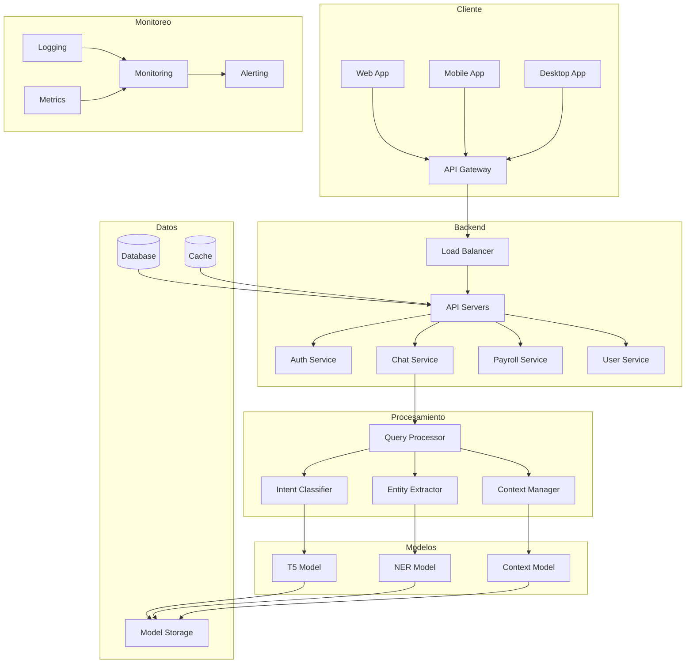
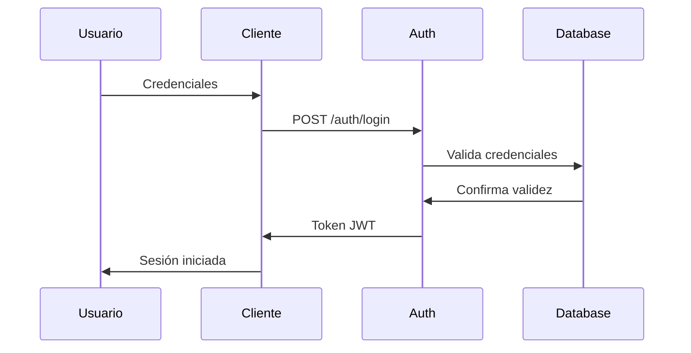
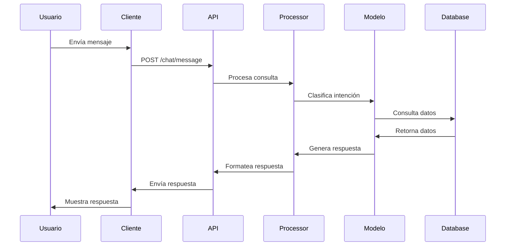
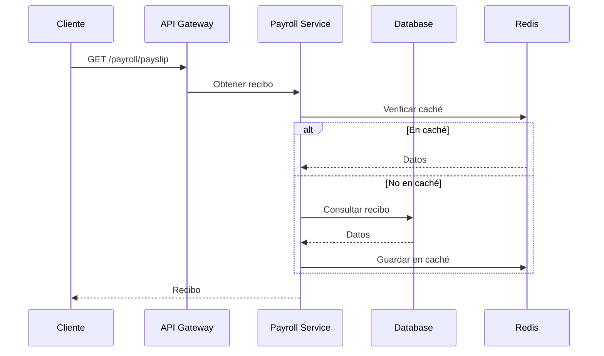

# Arquitectura - ChatNomina

## Visión General

ChatNomina es un sistema de chat inteligente diseñado para manejar consultas sobre nómina. Esta documentación detalla la arquitectura del sistema, sus componentes, interacciones y decisiones de diseño.

## Diagrama de Arquitectura



## Componentes Principales

### 1. Cliente

#### Web App
- Frontend en React
- Material-UI para componentes
- Redux para estado
- WebSocket para chat en tiempo real
- PWA para funcionalidad offline

#### Mobile App
- React Native
- Componentes nativos
- Offline storage
- Push notifications
- Biometría

#### Desktop App
- Electron
- Auto-updates
- Tray integration
- Keyboard shortcuts
- System notifications

### 2. API Gateway

#### Load Balancer
- Nginx
- SSL termination
- Rate limiting
- IP whitelisting
- Health checks

#### API Servers
- FastAPI
- OpenAPI/Swagger
- JWT validation
- Request/Response logging
- CORS management

### 3. Servicios

#### Auth Service
```python
class AuthService:
    """Servicio de autenticación."""
    
    def __init__(self, db: Database, redis: Redis):
        self.db = db
        self.redis = redis
        self.jwt = JWTManager()
    
    async def authenticate(self, credentials: Credentials) -> Token:
        """Autentica un usuario."""
        user = await self.db.get_user(credentials.username)
        if not user or not self.verify_password(credentials.password, user.password):
            raise AuthenticationError()
            
        token = self.jwt.create_token(user.id)
        await self.redis.set(f"token:{token}", user.id, expire=3600)
        
        return Token(access_token=token)
    
    async def validate_token(self, token: str) -> User:
        """Valida un token JWT."""
        try:
            user_id = await self.redis.get(f"token:{token}")
            if not user_id:
                raise InvalidTokenError()
                
            return await self.db.get_user_by_id(user_id)
        except JWTError:
            raise InvalidTokenError()
```

#### Chat Service
```python
class ChatService:
    """Servicio de chat."""
    
    def __init__(
        self,
        db: Database,
        redis: Redis,
        queue: MessageQueue,
        models: ModelManager
    ):
        self.db = db
        self.redis = redis
        self.queue = queue
        self.models = models
    
    async def process_message(
        self,
        message: str,
        context: Dict[str, Any]
    ) -> Dict[str, Any]:
        """Procesa un mensaje del usuario."""
        # Validar mensaje
        if not message.strip():
            raise ValueError("Mensaje vacío")
            
        # Encolar mensaje
        message_id = await self.queue.enqueue(
            "process_message",
            {
                "message": message,
                "context": context
            }
        )
        
        # Obtener respuesta
        response = await self.queue.get_result(message_id)
        
        # Guardar en historial
        await self.db.save_message(
            user_id=context["user_id"],
            message=message,
            response=response
        )
        
        return response
```

#### Payroll Service
```python
class PayrollService:
    """Servicio de nómina."""
    
    def __init__(self, db: Database, redis: Redis):
        self.db = db
        self.redis = redis
    
    async def get_payslip(
        self,
        user_id: str,
        month: int,
        year: int
    ) -> Dict[str, Any]:
        """Obtiene recibo de nómina."""
        # Verificar caché
        cache_key = f"payslip:{user_id}:{year}:{month}"
        cached = await self.redis.get(cache_key)
        if cached:
            return json.loads(cached)
            
        # Obtener de base de datos
        payslip = await self.db.get_payslip(user_id, month, year)
        if not payslip:
            raise PayslipNotFoundError()
            
        # Guardar en caché
        await self.redis.set(
            cache_key,
            json.dumps(payslip),
            expire=3600
        )
        
        return payslip
```

#### User Service
```python
class UserService:
    """Servicio de usuarios."""
    
    def __init__(self, db: Database, redis: Redis):
        self.db = db
        self.redis = redis
    
    async def get_profile(self, user_id: str) -> Dict[str, Any]:
        """Obtiene perfil de usuario."""
        # Verificar caché
        cache_key = f"profile:{user_id}"
        cached = await self.redis.get(cache_key)
        if cached:
            return json.loads(cached)
            
        # Obtener de base de datos
        profile = await self.db.get_user_profile(user_id)
        if not profile:
            raise UserNotFoundError()
            
        # Guardar en caché
        await self.redis.set(
            cache_key,
            json.dumps(profile),
            expire=3600
        )
        
        return profile
```

### 4. Procesamiento

#### Query Processor
```python
class QueryProcessor:
    """Procesador de consultas."""
    
    def __init__(
        self,
        intent_classifier: IntentClassifier,
        entity_extractor: EntityExtractor,
        context_manager: ContextManager
    ):
        self.intent_classifier = intent_classifier
        self.entity_extractor = entity_extractor
        self.context_manager = context_manager
    
    async def process(
        self,
        message: str,
        context: Dict[str, Any]
    ) -> Dict[str, Any]:
        """Procesa una consulta."""
        # Clasificar intención
        intent = await self.intent_classifier.classify(message)
        
        # Extraer entidades
        entities = await self.entity_extractor.extract(message)
        
        # Actualizar contexto
        context = await self.context_manager.update(
            message,
            intent,
            entities,
            context
        )
        
        # Generar respuesta
        response = await self.generate_response(
            message,
            intent,
            entities,
            context
        )
        
        return {
            "text": response.text,
            "confidence": response.confidence,
            "entities": entities,
            "intent": intent,
            "context": context
        }
```

#### Intent Classifier
```python
class IntentClassifier:
    """Clasificador de intención."""
    
    def __init__(self, model: Model):
        self.model = model
    
    async def classify(self, message: str) -> str:
        """Clasifica la intención de un mensaje."""
        # Implementar la lógica para clasificar la intención
        pass
```

#### Entity Extractor
```python
class EntityExtractor:
    """Extractor de entidades."""
    
    def __init__(self, model: Model):
        self.model = model
    
    async def extract(self, message: str) -> List[Entity]:
        """Extrae entidades de un mensaje."""
        # Implementar la lógica para extraer entidades
        pass
```

#### Context Manager
```python
class ContextManager:
    """Gestor de contexto."""
    
    def __init__(self, model: Model):
        self.model = model
    
    async def update(
        self,
        message: str,
        intent: str,
        entities: List[Entity],
        context: Dict[str, Any]
    ) -> Dict[str, Any]:
        """Actualiza el contexto."""
        # Implementar la lógica para actualizar el contexto
        pass
```

### 5. Modelos

#### T5 Model
```python
class T5Model:
    """Modelo T5."""
    
    def __init__(self, model_path: str):
        self.model = load_model(model_path)
    
    async def generate_response(
        self,
        message: str,
        intent: str,
        entities: List[Entity],
        context: Dict[str, Any]
    ) -> Response:
        """Genera una respuesta basada en el modelo T5."""
        # Implementar la lógica para generar una respuesta usando el modelo T5
        pass
```

#### NER Model
```python
class NERModel:
    """Modelo de Extracción de Entidades."""
    
    def __init__(self, model_path: str):
        self.model = load_model(model_path)
    
    async def extract(self, message: str) -> List[Entity]:
        """Extrae entidades de un mensaje."""
        # Implementar la lógica para extraer entidades usando el modelo NER
        pass
```

#### Context Model
```python
class ContextModel:
    """Modelo de Contexto."""
    
    def __init__(self, model_path: str):
        self.model = load_model(model_path)
    
    async def update(
        self,
        message: str,
        intent: str,
        entities: List[Entity],
        context: Dict[str, Any]
    ) -> Dict[str, Any]:
        """Actualiza el contexto."""
        # Implementar la lógica para actualizar el contexto usando el modelo de contexto
        pass
```

### 6. Datos

#### Database
```sql
-- Esquema de base de datos
CREATE TABLE users (
    id UUID PRIMARY KEY,
    email VARCHAR(255) UNIQUE NOT NULL,
    password_hash VARCHAR(255) NOT NULL,
    name VARCHAR(255) NOT NULL,
    department VARCHAR(100),
    position VARCHAR(100),
    hire_date DATE NOT NULL,
    created_at TIMESTAMP WITH TIME ZONE DEFAULT CURRENT_TIMESTAMP,
    updated_at TIMESTAMP WITH TIME ZONE DEFAULT CURRENT_TIMESTAMP
);

CREATE TABLE messages (
    id UUID PRIMARY KEY,
    user_id UUID REFERENCES users(id),
    message TEXT NOT NULL,
    response TEXT NOT NULL,
    intent VARCHAR(100),
    confidence FLOAT,
    entities JSONB,
    created_at TIMESTAMP WITH TIME ZONE DEFAULT CURRENT_TIMESTAMP
);

CREATE TABLE payslips (
    id UUID PRIMARY KEY,
    user_id UUID REFERENCES users(id),
    month INTEGER NOT NULL,
    year INTEGER NOT NULL,
    base_salary DECIMAL(12,2) NOT NULL,
    deductions JSONB NOT NULL,
    net_salary DECIMAL(12,2) NOT NULL,
    payment_date DATE NOT NULL,
    created_at TIMESTAMP WITH TIME ZONE DEFAULT CURRENT_TIMESTAMP,
    UNIQUE(user_id, month, year)
);
```

#### Cache
```python
class RedisManager:
    """Gestor de Redis."""
    
    def __init__(self, redis: Redis):
        self.redis = redis
    
    async def cache_get(self, key: str) -> Optional[str]:
        """Obtiene valor de caché."""
        return await self.redis.get(key)
    
    async def cache_set(
        self,
        key: str,
        value: str,
        expire: int = 3600
    ) -> None:
        """Guarda valor en caché."""
        await self.redis.set(key, value, ex=expire)
    
    async def cache_delete(self, key: str) -> None:
        """Elimina valor de caché."""
        await self.redis.delete(key)
    
    async def cache_pattern_delete(self, pattern: str) -> None:
        """Elimina valores por patrón."""
        keys = await self.redis.keys(pattern)
        if keys:
            await self.redis.delete(*keys)
```

#### Model Storage
```python
class ModelStorage:
    """Almacenamiento de modelos."""
    
    def __init__(self, storage: Storage):
        self.storage = storage
    
    async def save_model(
        self,
        model_id: str,
        model_data: bytes,
        metadata: Dict[str, Any]
    ) -> None:
        """Guarda un modelo."""
        # Guardar modelo
        await self.storage.upload(
            f"models/{model_id}/model.pt",
            model_data
        )
        
        # Guardar metadata
        await self.storage.upload(
            f"models/{model_id}/metadata.json",
            json.dumps(metadata).encode()
        )
    
    async def load_model(
        self,
        model_id: str
    ) -> Tuple[bytes, Dict[str, Any]]:
        """Carga un modelo."""
        # Cargar modelo
        model_data = await self.storage.download(
            f"models/{model_id}/model.pt"
        )
        
        # Cargar metadata
        metadata = json.loads(
            (await self.storage.download(
                f"models/{model_id}/metadata.json"
            )).decode()
        )
        
        return model_data, metadata
```

### 7. Monitoreo

#### Logging
```yaml
# logstash.conf
input {
  beats {
    port => 5044
  }
}

filter {
  if [type] == "chatnomina" {
    json {
      source => "message"
    }
    date {
      match => ["timestamp", "ISO8601"]
      target => "@timestamp"
    }
  }
}

output {
  elasticsearch {
    hosts => ["localhost:9200"]
    index => "chatnomina-%{+YYYY.MM.dd}"
  }
}
```

#### Monitoring
```json
{
  "dashboard": {
    "id": null,
    "title": "ChatNomina Dashboard",
    "tags": ["chatnomina", "monitoring"],
    "timezone": "browser",
    "panels": [
      {
        "title": "Requests per Second",
        "type": "graph",
        "datasource": "Prometheus",
        "targets": [
          {
            "expr": "rate(chatnomina_requests_total[5m])",
            "legendFormat": "{{method}} {{path}}"
          }
        ]
      },
      {
        "title": "Response Time",
        "type": "graph",
        "datasource": "Prometheus",
        "targets": [
          {
            "expr": "rate(chatnomina_request_duration_seconds_sum[5m]) / rate(chatnomina_request_duration_seconds_count[5m])",
            "legendFormat": "{{path}}"
          }
        ]
      }
    ]
  }
}
```

#### Alerting
```python
class AlertManager:
    """Gestor de alertas."""
    
    def __init__(self, prometheus: Prometheus):
        self.prometheus = prometheus
    
    async def check_alerts(self):
        """Revisa alertas."""
        # Implementar la lógica para revisar alertas
        pass
```

#### Metrics
```python
class Metrics:
    """Métricas del sistema."""
    
    def __init__(self, prometheus: Prometheus):
        self.prometheus = prometheus
        
        # Métricas
        self.request_count = Counter(
            "chatnomina_requests_total",
            "Total de peticiones",
            ["endpoint", "method", "status"]
        )
        
        self.request_latency = Histogram(
            "chatnomina_request_duration_seconds",
            "Duración de peticiones",
            ["endpoint"]
        )
        
        self.model_latency = Histogram(
            "chatnomina_model_duration_seconds",
            "Duración de modelos",
            ["model"]
        )
    
    async def record_request(
        self,
        endpoint: str,
        method: str,
        status: int,
        duration: float
    ):
        """Registra métrica de petición."""
        self.request_count.labels(
            endpoint=endpoint,
            method=method,
            status=status
        ).inc()
        
        self.request_latency.labels(
            endpoint=endpoint
        ).observe(duration)
    
    async def record_model(
        self,
        model: str,
        duration: float
    ):
        """Registra métrica de modelo."""
        self.model_latency.labels(
            model=model
        ).observe(duration)
```

## Flujos de Datos

### 1. Autenticación



### 2. Procesamiento de Mensaje



### 3. Consulta de Nómina



## Decisiones de Diseño

### 1. Microservicios

#### Ventajas
- Escalabilidad independiente
- Despliegue independiente
- Tecnologías específicas
- Aislamiento de fallos

#### Desventajas
- Complejidad operativa
- Latencia de red
- Consistencia de datos
- Monitoreo distribuido

### 2. Event-Driven

#### Ventajas
- Desacoplamiento
- Escalabilidad
- Resiliencia
- Trazabilidad

#### Desventajas
- Complejidad
- Debugging
- Testing
- Orden de eventos

### 3. Caché

#### Estrategias
- Cache-Aside
- Write-Through
- Write-Back
- Refresh-Ahead

#### Consideraciones
- Invalidez
- Consistencia
- TTL
- Memoria

### 4. Base de Datos

#### PostgreSQL
- ACID
- JSONB
- Full-text search
- Particionamiento

#### Redis
- Caché
- Colas
- Pub/Sub
- Rate limiting

### 5. Seguridad

#### Autenticación
- JWT
- Refresh tokens
- Revocación
- Rate limiting

#### Autorización
- RBAC
- ACL
- OAuth2
- OpenID Connect

### 6. Monitoreo

#### Métricas
- Latencia
- Throughput
- Error rate
- Resource usage

#### Logging
- Structured logging
- Log levels
- Log rotation
- Log aggregation

## Escalabilidad

### 1. Horizontal

#### Servicios
- Load balancing
- Service discovery
- Health checks
- Auto-scaling

#### Base de Datos
- Read replicas
- Sharding
- Connection pooling
- Query optimization

### 2. Vertical

#### Servicios
- Resource limits
- Memory management
- CPU optimization
- I/O optimization

#### Base de Datos
- Indexing
- Vacuuming
- Partitioning
- Archiving

## Resiliencia

### 1. Circuit Breaker

```python
class CircuitBreaker:
    """Circuit breaker para servicios."""
    
    def __init__(
        self,
        failure_threshold: int = 5,
        reset_timeout: int = 60
    ):
        self.failure_threshold = failure_threshold
        self.reset_timeout = reset_timeout
        self.failures = 0
        self.last_failure = None
        self.state = "closed"
    
    async def execute(self, func: Callable, *args, **kwargs):
        """Ejecuta función con circuit breaker."""
        if self.state == "open":
            if time.time() - self.last_failure > self.reset_timeout:
                self.state = "half-open"
            else:
                raise CircuitBreakerOpenError()
                
        try:
            result = await func(*args, **kwargs)
            if self.state == "half-open":
                self.state = "closed"
                self.failures = 0
            return result
        except Exception as e:
            self.failures += 1
            self.last_failure = time.time()
            if self.failures >= self.failure_threshold:
                self.state = "open"
            raise
```

### 2. Retry

```python
class Retry:
    """Retry para operaciones."""
    
    def __init__(
        self,
        max_attempts: int = 3,
        delay: float = 1.0,
        backoff: float = 2.0
    ):
        self.max_attempts = max_attempts
        self.delay = delay
        self.backoff = backoff
    
    async def execute(self, func: Callable, *args, **kwargs):
        """Ejecuta función con retry."""
        last_exception = None
        current_delay = self.delay
        
        for attempt in range(self.max_attempts):
            try:
                return await func(*args, **kwargs)
            except Exception as e:
                last_exception = e
                if attempt < self.max_attempts - 1:
                    await asyncio.sleep(current_delay)
                    current_delay *= self.backoff
                    
        raise last_exception
```