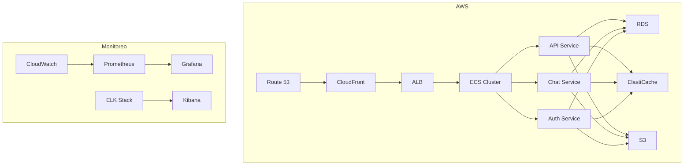
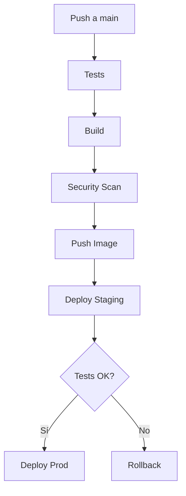

# Guía de Despliegue - ChatNomina

## Visión General

ChatNomina utiliza una arquitectura de microservicios desplegada en la nube, con un enfoque en alta disponibilidad, escalabilidad y seguridad.

## Infraestructura

### 1. Diagrama de Infraestructura



### 2. Componentes

#### Redes
- VPC con subredes públicas y privadas
- Security Groups
- NACLs
- Internet Gateway
- NAT Gateway

#### Computación
- ECS Fargate
- Auto Scaling Groups
- Load Balancers
- Container Registry

#### Almacenamiento
- RDS PostgreSQL
- ElastiCache Redis
- S3
- EFS

#### Redes de Entrega
- CloudFront
- Route 53
- ACM
- WAF

## Configuración

### 1. Variables de Entorno

#### Producción
```env
# Base de datos
DB_HOST=chatnomina-prod.cluster-123.region.rds.amazonaws.com
DB_PORT=5432
DB_NAME=chatnomina
DB_USER=admin
DB_PASSWORD=****

# Redis
REDIS_HOST=chatnomina-cache.region.cache.amazonaws.com
REDIS_PORT=6379
REDIS_PASSWORD=****

# S3
S3_BUCKET=chatnomina-prod
AWS_REGION=us-east-1
AWS_ACCESS_KEY_ID=****
AWS_SECRET_ACCESS_KEY=****

# API
API_VERSION=v1
API_PORT=8000
ENVIRONMENT=production
LOG_LEVEL=info

# Seguridad
JWT_SECRET=****
JWT_EXPIRATION=3600
CORS_ORIGINS=https://chatnomina.com
```

#### Staging
```env
# Base de datos
DB_HOST=chatnomina-staging.cluster-123.region.rds.amazonaws.com
DB_PORT=5432
DB_NAME=chatnomina_staging
DB_USER=admin
DB_PASSWORD=****

# Redis
REDIS_HOST=chatnomina-staging-cache.region.cache.amazonaws.com
REDIS_PORT=6379
REDIS_PASSWORD=****

# S3
S3_BUCKET=chatnomina-staging
AWS_REGION=us-east-1
AWS_ACCESS_KEY_ID=****
AWS_SECRET_ACCESS_KEY=****

# API
API_VERSION=v1
API_PORT=8000
ENVIRONMENT=staging
LOG_LEVEL=debug

# Seguridad
JWT_SECRET=****
JWT_EXPIRATION=3600
CORS_ORIGINS=https://staging.chatnomina.com
```

### 2. Configuración de Docker

#### Dockerfile
```dockerfile
# Base image
FROM python:3.8-slim

# Set working directory
WORKDIR /app

# Install system dependencies
RUN apt-get update && apt-get install -y \
    build-essential \
    curl \
    && rm -rf /var/lib/apt/lists/*

# Copy requirements
COPY requirements.txt .

# Install Python dependencies
RUN pip install --no-cache-dir -r requirements.txt

# Copy application code
COPY . .

# Set environment variables
ENV PYTHONPATH=/app
ENV PYTHONUNBUFFERED=1

# Expose port
EXPOSE 8000

# Run application
CMD ["uvicorn", "app.main:app", "--host", "0.0.0.0", "--port", "8000"]
```

#### docker-compose.yml
```yaml
version: '3.8'

services:
  api:
    build: .
    ports:
      - "8000:8000"
    environment:
      - DB_HOST=db
      - DB_PORT=5432
      - DB_NAME=chatnomina
      - DB_USER=admin
      - DB_PASSWORD=admin
      - REDIS_HOST=redis
      - REDIS_PORT=6379
    depends_on:
      - db
      - redis

  db:
    image: postgres:13
    environment:
      - POSTGRES_DB=chatnomina
      - POSTGRES_USER=admin
      - POSTGRES_PASSWORD=admin
    volumes:
      - postgres_data:/var/lib/postgresql/data

  redis:
    image: redis:6
    command: redis-server --requirepass admin
    volumes:
      - redis_data:/data

volumes:
  postgres_data:
  redis_data:
```

### 3. Configuración de Kubernetes

#### deployment.yaml
```yaml
apiVersion: apps/v1
kind: Deployment
metadata:
  name: chatnomina-api
  namespace: production
spec:
  replicas: 3
  selector:
    matchLabels:
      app: chatnomina-api
  template:
    metadata:
      labels:
        app: chatnomina-api
    spec:
      containers:
      - name: api
        image: chatnomina/api:latest
        ports:
        - containerPort: 8000
        env:
        - name: DB_HOST
          valueFrom:
            secretKeyRef:
              name: chatnomina-secrets
              key: db-host
        - name: DB_PASSWORD
          valueFrom:
            secretKeyRef:
              name: chatnomina-secrets
              key: db-password
        resources:
          requests:
            memory: "256Mi"
            cpu: "200m"
          limits:
            memory: "512Mi"
            cpu: "500m"
        livenessProbe:
          httpGet:
            path: /health
            port: 8000
          initialDelaySeconds: 30
          periodSeconds: 10
        readinessProbe:
          httpGet:
            path: /ready
            port: 8000
          initialDelaySeconds: 5
          periodSeconds: 5
```

#### service.yaml
```yaml
apiVersion: v1
kind: Service
metadata:
  name: chatnomina-api
  namespace: production
spec:
  type: ClusterIP
  ports:
  - port: 80
    targetPort: 8000
  selector:
    app: chatnomina-api
```

#### ingress.yaml
```yaml
apiVersion: networking.k8s.io/v1
kind: Ingress
metadata:
  name: chatnomina-ingress
  namespace: production
  annotations:
    kubernetes.io/ingress.class: nginx
    cert-manager.io/cluster-issuer: letsencrypt-prod
spec:
  tls:
  - hosts:
    - api.chatnomina.com
    secretName: chatnomina-tls
  rules:
  - host: api.chatnomina.com
    http:
      paths:
      - path: /
        pathType: Prefix
        backend:
          service:
            name: chatnomina-api
            port:
              number: 80
```

## Proceso de Despliegue

### 1. Pipeline CI/CD



### 2. Scripts de Despliegue

#### deploy.sh
```bash
#!/bin/bash

# Variables
ENVIRONMENT=$1
VERSION=$2
NAMESPACE="production"

# Validar argumentos
if [ -z "$ENVIRONMENT" ] || [ -z "$VERSION" ]; then
    echo "Uso: ./deploy.sh <environment> <version>"
    exit 1
fi

# Login a ECR
aws ecr get-login-password --region us-east-1 | docker login --username AWS --password-stdin $ECR_REGISTRY

# Actualizar imágenes
kubectl set image deployment/chatnomina-api \
    api=$ECR_REGISTRY/chatnomina-api:$VERSION \
    -n $NAMESPACE

# Esperar rollout
kubectl rollout status deployment/chatnomina-api -n $NAMESPACE

# Verificar health
curl -f https://api.chatnomina.com/health || exit 1

echo "Despliegue completado exitosamente"
```

#### rollback.sh
```bash
#!/bin/bash

# Variables
ENVIRONMENT=$1
VERSION=$2
NAMESPACE="production"

# Validar argumentos
if [ -z "$ENVIRONMENT" ] || [ -z "$VERSION" ]; then
    echo "Uso: ./rollback.sh <environment> <version>"
    exit 1
fi

# Rollback a versión anterior
kubectl rollout undo deployment/chatnomina-api \
    --to-revision=$VERSION \
    -n $NAMESPACE

# Esperar rollout
kubectl rollout status deployment/chatnomina-api -n $NAMESPACE

echo "Rollback completado exitosamente"
```

### 3. Monitoreo Post-Despliegue

#### Métricas a Monitorear
- Latencia de API
- Tasa de error
- Uso de CPU/Memoria
- Conexiones a base de datos
- Tiempo de respuesta Redis
- Uso de S3
- Costos

#### Alertas
- Error rate > 1%
- Latencia > 200ms
- CPU > 80%
- Memoria > 80%
- Disk > 80%
- 5xx errors
- 4xx errors

## Mantenimiento

### 1. Backup

#### Base de Datos
```bash
# Backup diario
pg_dump -h $DB_HOST -U $DB_USER -d $DB_NAME | gzip > backup_$(date +%Y%m%d).sql.gz

# Restore
gunzip -c backup_20240320.sql.gz | psql -h $DB_HOST -U $DB_USER -d $DB_NAME
```

#### Redis
```bash
# Backup
redis-cli -h $REDIS_HOST -a $REDIS_PASSWORD SAVE

# Restore
redis-cli -h $REDIS_HOST -a $REDIS_PASSWORD FLUSHALL
redis-cli -h $REDIS_HOST -a $REDIS_PASSWORD < backup.rdb
```

### 2. Actualizaciones

#### Sistema
```bash
# Actualizar sistema
apt-get update && apt-get upgrade -y

# Actualizar dependencias
pip install --upgrade -r requirements.txt

# Actualizar imágenes
docker pull chatnomina/api:latest
```

#### Base de Datos
```sql
-- Migraciones
alembic upgrade head

-- Vacuum
VACUUM ANALYZE;
```

### 3. Limpieza

#### Logs
```bash
# Rotar logs
logrotate /etc/logrotate.d/chatnomina

# Limpiar logs antiguos
find /var/log/chatnomina -type f -mtime +30 -delete
```

#### Docker
```bash
# Limpiar imágenes
docker image prune -a -f

# Limpiar contenedores
docker container prune -f

# Limpiar volúmenes
docker volume prune -f
```

## Recuperación de Desastres

### 1. Plan de Recuperación

1. Identificar fallo
2. Activar backup site
3. Restaurar datos
4. Verificar servicios
5. Redirigir tráfico
6. Monitorear

### 2. Procedimientos

#### Failover
```bash
# Activar backup site
aws route53 change-resource-record-sets \
    --hosted-zone-id $ZONE_ID \
    --change-batch file://failover.json

# Verificar DNS
dig api.chatnomina.com
```

#### Restore
```bash
# Restaurar base de datos
gunzip -c backup_latest.sql.gz | psql -h $DB_HOST -U $DB_USER -d $DB_NAME

# Restaurar Redis
redis-cli -h $REDIS_HOST -a $REDIS_PASSWORD < backup_latest.rdb

# Verificar servicios
curl -f https://api.chatnomina.com/health
```

### 3. Pruebas

#### Simulación
```bash
# Simular fallo
kubectl delete pod -l app=chatnomina-api -n production

# Verificar recuperación
kubectl get pods -n production
curl -f https://api.chatnomina.com/health
```

#### Documentación
- Procedimientos
- Contactos
- Escalamiento
- Post-mortem 