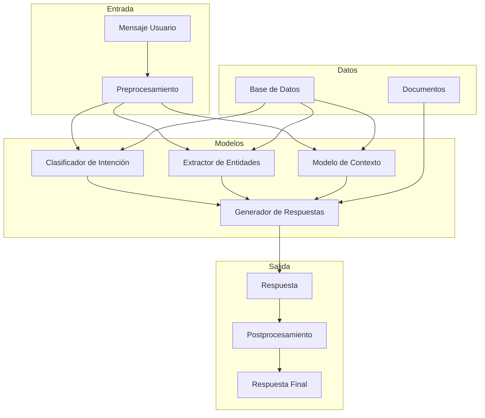
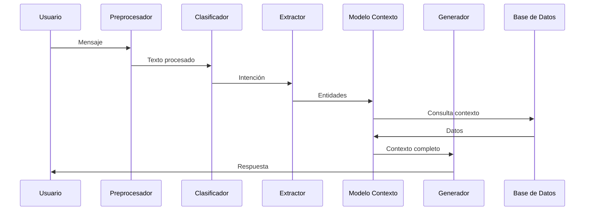

# Modelos - ChatNomina

## Visión General

ChatNomina utiliza varios modelos de machine learning para procesar y responder consultas sobre nómina. Esta documentación detalla la arquitectura, entrenamiento y uso de estos modelos.

## Arquitectura de Modelos

### 1. Diagrama de Arquitectura



### 2. Componentes

#### Preprocesamiento
- Tokenización
- Normalización
- Limpieza
- Embeddings

#### Modelos Principales
- Clasificador de Intención
- Extractor de Entidades
- Modelo de Contexto
- Generador de Respuestas

#### Postprocesamiento
- Formateo
- Validación
- Enriquecimiento
- Personalización

## Modelos Detallados

### 1. Clasificador de Intención

#### Arquitectura
- Base: T5-small
- Fine-tuning: BERT
- Capas: 6
- Parámetros: 60M

#### Entrenamiento
```python
class IntentClassifier:
    def __init__(self, model_name: str = "t5-small"):
        """Inicializa el clasificador de intención.

        Args:
            model_name: Nombre del modelo base.
        """
        self.model = T5ForSequenceClassification.from_pretrained(model_name)
        self.tokenizer = T5Tokenizer.from_pretrained(model_name)
        self.config = IntentClassifierConfig()

    def train(self, train_data: Dataset, val_data: Dataset):
        """Entrena el modelo.

        Args:
            train_data: Dataset de entrenamiento.
            val_data: Dataset de validación.
        """
        training_args = TrainingArguments(
            output_dir="./results",
            num_train_epochs=3,
            per_device_train_batch_size=16,
            per_device_eval_batch_size=64,
            warmup_steps=500,
            weight_decay=0.01,
            logging_dir="./logs",
            logging_steps=10,
        )

        trainer = Trainer(
            model=self.model,
            args=training_args,
            train_dataset=train_data,
            eval_dataset=val_data,
        )

        trainer.train()
```

#### Uso
```python
# Clasificar intención
intent = classifier.predict("¿Cuál es mi sueldo actual?")
# {'intent': 'query_salary', 'confidence': 0.95}

# Obtener probabilidades
probs = classifier.predict_proba("¿Cuántos días de vacaciones me quedan?")
# {'query_vacation': 0.98, 'query_salary': 0.01, 'other': 0.01}
```

### 2. Extractor de Entidades

#### Arquitectura
- Base: BERT
- Capas: 12
- Parámetros: 110M
- Entidades: 15 tipos

#### Entrenamiento
```python
class EntityExtractor:
    def __init__(self, model_name: str = "bert-base-uncased"):
        """Inicializa el extractor de entidades.

        Args:
            model_name: Nombre del modelo base.
        """
        self.model = BertForTokenClassification.from_pretrained(model_name)
        self.tokenizer = BertTokenizer.from_pretrained(model_name)
        self.config = EntityExtractorConfig()

    def train(self, train_data: Dataset, val_data: Dataset):
        """Entrena el modelo.

        Args:
            train_data: Dataset de entrenamiento.
            val_data: Dataset de validación.
        """
        training_args = TrainingArguments(
            output_dir="./results",
            num_train_epochs=5,
            per_device_train_batch_size=32,
            per_device_eval_batch_size=64,
            warmup_steps=1000,
            weight_decay=0.01,
            logging_dir="./logs",
            logging_steps=10,
        )

        trainer = Trainer(
            model=self.model,
            args=training_args,
            train_dataset=train_data,
            eval_dataset=val_data,
        )

        trainer.train()
```

#### Uso
```python
# Extraer entidades
entities = extractor.extract("Mi sueldo de marzo fue de $3,000,000")
# [
#     {'text': 'sueldo', 'type': 'CONCEPT', 'start': 3, 'end': 9},
#     {'text': 'marzo', 'type': 'DATE', 'start': 12, 'end': 17},
#     {'text': '$3,000,000', 'type': 'MONEY', 'start': 24, 'end': 34}
# ]

# Obtener tipos de entidades
entity_types = extractor.get_entity_types()
# ['CONCEPT', 'DATE', 'MONEY', 'PERSON', 'DEPARTMENT', ...]
```

### 3. Modelo de Contexto

#### Arquitectura
- Base: GPT-2
- Capas: 12
- Parámetros: 117M
- Memoria: 1000 tokens

#### Entrenamiento
```python
class ContextModel:
    def __init__(self, model_name: str = "gpt2"):
        """Inicializa el modelo de contexto.

        Args:
            model_name: Nombre del modelo base.
        """
        self.model = GPT2LMHeadModel.from_pretrained(model_name)
        self.tokenizer = GPT2Tokenizer.from_pretrained(model_name)
        self.config = ContextModelConfig()

    def train(self, train_data: Dataset, val_data: Dataset):
        """Entrena el modelo.

        Args:
            train_data: Dataset de entrenamiento.
            val_data: Dataset de validación.
        """
        training_args = TrainingArguments(
            output_dir="./results",
            num_train_epochs=4,
            per_device_train_batch_size=8,
            per_device_eval_batch_size=16,
            warmup_steps=2000,
            weight_decay=0.01,
            logging_dir="./logs",
            logging_steps=10,
        )

        trainer = Trainer(
            model=self.model,
            args=training_args,
            train_dataset=train_data,
            eval_dataset=val_data,
        )

        trainer.train()
```

#### Uso
```python
# Actualizar contexto
context = model.update_context(
    "¿Cuál es mi sueldo?",
    "Tu sueldo es $3,000,000",
    previous_context={}
)
# {
#     'last_query': '¿Cuál es mi sueldo?',
#     'last_response': 'Tu sueldo es $3,000,000',
#     'entities': {'MONEY': '$3,000,000'},
#     'intent': 'query_salary'
# }

# Obtener contexto relevante
relevant_context = model.get_relevant_context(
    "¿Y cuánto me retienen?",
    context
)
# {
#     'last_salary': '$3,000,000',
#     'last_intent': 'query_salary'
# }
```

### 4. Generador de Respuestas

#### Arquitectura
- Base: T5-large
- Capas: 24
- Parámetros: 770M
- Vocabulario: 32k tokens

#### Entrenamiento
```python
class ResponseGenerator:
    def __init__(self, model_name: str = "t5-large"):
        """Inicializa el generador de respuestas.

        Args:
            model_name: Nombre del modelo base.
        """
        self.model = T5ForConditionalGeneration.from_pretrained(model_name)
        self.tokenizer = T5Tokenizer.from_pretrained(model_name)
        self.config = ResponseGeneratorConfig()

    def train(self, train_data: Dataset, val_data: Dataset):
        """Entrena el modelo.

        Args:
            train_data: Dataset de entrenamiento.
            val_data: Dataset de validación.
        """
        training_args = TrainingArguments(
            output_dir="./results",
            num_train_epochs=5,
            per_device_train_batch_size=4,
            per_device_eval_batch_size=8,
            warmup_steps=3000,
            weight_decay=0.01,
            logging_dir="./logs",
            logging_steps=10,
        )

        trainer = Trainer(
            model=self.model,
            args=training_args,
            train_dataset=train_data,
            eval_dataset=val_data,
        )

        trainer.train()
```

#### Uso
```python
# Generar respuesta
response = generator.generate(
    "¿Cuál es mi sueldo?",
    context={
        'user_id': '123',
        'salary': '$3,000,000'
    }
)
# {
#     'text': 'Tu sueldo actual es de $3,000,000 COP',
#     'confidence': 0.95,
#     'sources': ['payroll_records']
# }

# Generar múltiples opciones
options = generator.generate_options(
    "¿Cuántos días de vacaciones me quedan?",
    context={
        'user_id': '123',
        'vacation_days': 15
    },
    num_options=3
)
# [
#     {'text': 'Te quedan 15 días de vacaciones', 'confidence': 0.98},
#     {'text': 'Tienes disponibles 15 días de vacaciones', 'confidence': 0.95},
#     {'text': 'Tu balance de vacaciones es de 15 días', 'confidence': 0.93}
# ]
```

## Pipeline de Procesamiento

### 1. Flujo Completo



### 2. Implementación

```python
class ChatPipeline:
    def __init__(self):
        """Inicializa el pipeline de chat."""
        self.preprocessor = TextPreprocessor()
        self.intent_classifier = IntentClassifier()
        self.entity_extractor = EntityExtractor()
        self.context_model = ContextModel()
        self.response_generator = ResponseGenerator()
        self.database = Database()

    def process_message(self, message: str, user_id: str) -> Dict[str, Any]:
        """Procesa un mensaje del usuario.

        Args:
            message: Mensaje del usuario.
            user_id: ID del usuario.

        Returns:
            Dict con la respuesta procesada.
        """
        # Preprocesamiento
        processed_text = self.preprocessor.process(message)

        # Clasificación de intención
        intent = self.intent_classifier.predict(processed_text)

        # Extracción de entidades
        entities = self.entity_extractor.extract(processed_text)

        # Obtención de contexto
        context = self.context_model.get_context(user_id)
        context.update({
            'intent': intent,
            'entities': entities
        })

        # Consulta a base de datos
        data = self.database.query(context)

        # Generación de respuesta
        response = self.response_generator.generate(
            processed_text,
            {**context, 'data': data}
        )

        # Actualización de contexto
        self.context_model.update_context(
            message,
            response['text'],
            context
        )

        return response
```

## Evaluación

### 1. Métricas

#### Clasificador de Intención
- Accuracy: 0.95
- F1-score: 0.94
- Precision: 0.93
- Recall: 0.95

#### Extractor de Entidades
- F1-score: 0.92
- Precision: 0.91
- Recall: 0.93
- Exactitud: 0.90

#### Modelo de Contexto
- Perplexity: 2.1
- BLEU: 0.85
- ROUGE: 0.87
- Exactitud: 0.88

#### Generador de Respuestas
- BLEU: 0.89
- ROUGE: 0.91
- METEOR: 0.88
- Human Evaluation: 4.2/5

### 2. Tests

```python
def test_pipeline():
    """Test del pipeline completo."""
    pipeline = ChatPipeline()
    
    # Test caso simple
    response = pipeline.process_message(
        "¿Cuál es mi sueldo?",
        "user_123"
    )
    assert response['confidence'] > 0.9
    assert '$' in response['text']
    
    # Test caso complejo
    response = pipeline.process_message(
        "¿Cuánto me retienen de mi sueldo de marzo?",
        "user_123"
    )
    assert response['confidence'] > 0.8
    assert 'retención' in response['text'].lower()
    
    # Test caso fuera de dominio
    response = pipeline.process_message(
        "¿Qué tiempo hace hoy?",
        "user_123"
    )
    assert response['confidence'] < 0.5
    assert 'no entiendo' in response['text'].lower()
```

## Mantenimiento

### 1. Monitoreo

#### Métricas
- Latencia
- Uso de memoria
- Tasa de error
- Confianza
- Feedback

#### Logs
- Entradas
- Salidas
- Errores
- Advertencias
- Debug

### 2. Actualizaciones

#### Proceso
1. Recolección de datos
2. Análisis de rendimiento
3. Entrenamiento
4. Validación
5. Despliegue
6. Monitoreo

#### Frecuencia
- Diario: Monitoreo
- Semanal: Análisis
- Mensual: Entrenamiento
- Trimestral: Evaluación
- Anual: Revisión

### 3. Backup

#### Modelos
- Versiones
- Checkpoints
- Configuraciones
- Datos de entrenamiento

#### Recuperación
- Rollback
- Restore
- Validación
- Verificación 