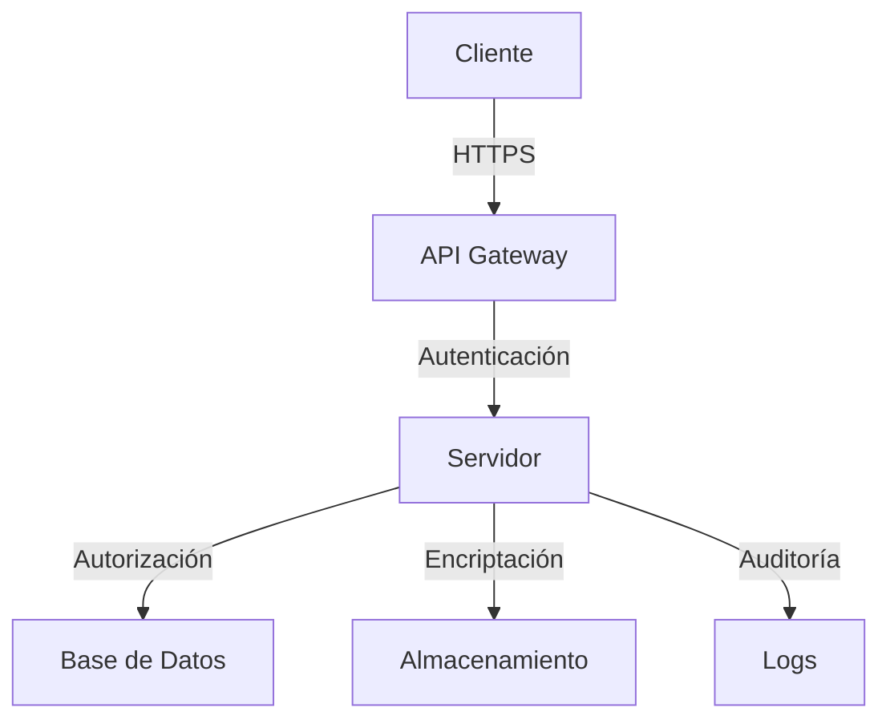

# Seguridad - ChatNomina

## Arquitectura de Seguridad

### 1. Capas de Seguridad

### 2. Componentes Principales
- API Gateway con WAF
- Servidor de Autenticación
- Servidor de Aplicación
- Base de Datos Encriptada
- Sistema de Logs
- Sistema de Backup

## Autenticación

### 1. Métodos de Autenticación
- Autenticación por Token JWT
- OAuth 2.0 para SSO
- Autenticación de dos factores (2FA)
- Autenticación biométrica (opcional)

### 2. Gestión de Sesiones
- Tokens de corta duración (15 minutos)
- Refresh tokens de larga duración (7 días)
- Revocación de sesiones
- Detección de sesiones concurrentes

### 3. Políticas de Contraseñas
- Mínimo 8 caracteres
- Requiere mayúsculas y minúsculas
- Requiere números
- Requiere caracteres especiales
- Cambio obligatorio cada 90 días
- Historial de contraseñas (últimas 5)

## Autorización

### 1. Roles y Permisos
- Administrador
- Usuario
- Auditor
- Soporte

### 2. Control de Acceso
- RBAC (Role-Based Access Control)
- ABAC (Attribute-Based Access Control)
- Políticas de acceso por recurso
- Políticas de acceso por acción

### 3. Escopos de Acceso
- Lectura de datos personales
- Escritura de datos personales
- Administración de usuarios
- Gestión de configuración
- Acceso a reportes
- Gestión de auditoría

## Protección de Datos

### 1. Encriptación
- En tránsito (TLS 1.3)
- En reposo (AES-256)
- Claves asimétricas (RSA-2048)
- Hashing de contraseñas (bcrypt)

### 2. Datos Sensibles
- Información personal
- Datos bancarios
- Historial de nómina
- Documentos legales

### 3. Manejo de Datos
- Minimización de datos
- Retención de datos
- Eliminación segura
- Anonimización

## Seguridad de la Aplicación

### 1. Protección contra Ataques
- SQL Injection
- XSS (Cross-Site Scripting)
- CSRF (Cross-Site Request Forgery)
- Inyección de comandos
- Ataques de fuerza bruta

### 2. Headers de Seguridad
- Content-Security-Policy
- X-Frame-Options
- X-Content-Type-Options
- Strict-Transport-Security
- X-XSS-Protection

### 3. Validación de Entrada
- Sanitización de datos
- Validación de tipos
- Validación de rangos
- Validación de formato

## Monitoreo y Auditoría

### 1. Logging
- Logs de autenticación
- Logs de autorización
- Logs de operaciones
- Logs de errores
- Logs de sistema

### 2. Monitoreo
- Detección de anomalías
- Monitoreo de rendimiento
- Monitoreo de recursos
- Alertas de seguridad

### 3. Auditoría
- Registro de cambios
- Registro de accesos
- Registro de configuraciones
- Registro de errores

## Respuesta a Incidentes

### 1. Plan de Respuesta
- Identificación
- Contención
- Erradicación
- Recuperación
- Lecciones aprendidas

### 2. Procedimientos
- Reporte de incidentes
- Escalamiento
- Comunicación
- Documentación
- Post-mortem

### 3. Roles y Responsabilidades
- Equipo de respuesta
- Equipo de soporte
- Equipo de desarrollo
- Equipo de operaciones
- Equipo de comunicación

## Cumplimiento

### 1. Estándares
- ISO 27001
- GDPR
- PCI DSS
- NIST

### 2. Políticas
- Política de seguridad
- Política de privacidad
- Política de retención
- Política de backup

### 3. Certificaciones
- Certificaciones de seguridad
- Auditorías externas
- Evaluaciones de vulnerabilidad
- Tests de penetración

## Mejores Prácticas

### 1. Desarrollo Seguro
- SDLC seguro
- Code review
- Testing de seguridad
- Gestión de dependencias

### 2. Operaciones Seguras
- Hardening de servidores
- Gestión de parches
- Backup y recuperación
- Gestión de cambios

### 3. Usuario Final
- Capacitación en seguridad
- Políticas de uso
- Reporte de incidentes
- Buenas prácticas

## Mantenimiento

### 1. Actualizaciones
- Parches de seguridad
- Actualizaciones de dependencias
- Actualizaciones de configuración
- Actualizaciones de políticas

### 2. Revisión Periódica
- Revisión de logs
- Revisión de accesos
- Revisión de políticas
- Revisión de certificados

### 3. Mejora Continua
- Análisis de incidentes
- Actualización de procedimientos
- Mejora de controles
- Actualización de documentación 