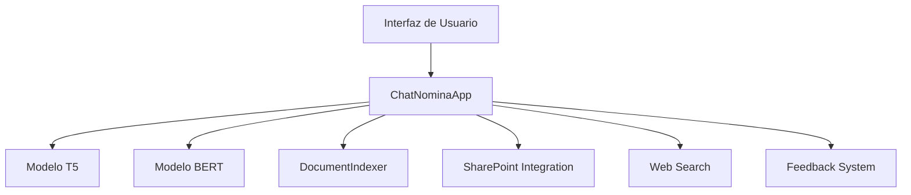

# Documentación Técnica - ChatNomina

## Arquitectura del Sistema

### 1. Componentes Principales

### 2. Flujo de Procesamiento
1. Recepción de pregunta
2. Clasificación de pregunta (BERT)
3. Procesamiento según tipo:
   - Datos específicos → Transformaciones
   - Normativa → Búsqueda en documentos
   - General → Modelo T5
4. Generación de respuesta
5. Feedback y logging

## Modelos de Machine Learning

### 1. Modelo T5
- **Propósito**: Generación de respuestas
- **Arquitectura**: T5 (Text-to-Text Transfer Transformer)
- **Entrenamiento**: Fine-tuning con datos de nómina
- **Capacidades**:
  - Generación de respuestas naturales
  - Comprensión de contexto
  - Manejo de múltiples tipos de consultas

### 2. Modelo BERT
- **Propósito**: Clasificación de preguntas
- **Arquitectura**: BERT (Bidirectional Encoder Representations from Transformers)
- **Categorías**:
  - Datos específicos
  - Información general
  - Consultas normativas

## Sistema de Procesamiento de Lenguaje Natural

### 1. Preprocesamiento
- Tokenización
- Limpieza de texto
- Normalización
- Eliminación de stopwords

### 2. Clasificación
- Análisis de intención
- Extracción de entidades
- Clasificación de categorías

### 3. Postprocesamiento
- Formateo de respuestas
- Validación de resultados
- Manejo de casos especiales

## Integración con SharePoint

### 1. Autenticación
- Microsoft Azure AD
- OAuth 2.0
- Manejo de tokens

### 2. Acceso a Documentos
- Lectura de archivos
- Caché de documentos
- Actualización automática

### 3. Estructura de Datos
- Documentos de nómina
- Normativas
- Plantillas

## Sistema de Feedback

### 1. Almacenamiento
- Registro de preguntas
- Registro de respuestas
- Calificación de usuarios
- Comentarios adicionales

### 2. Procesamiento
- Análisis de feedback
- Identificación de patrones
- Mejora continua

## Logging y Monitoreo

### 1. Sistema de Logs
- Niveles de logging
- Rotación de archivos
- Formato de logs
- Almacenamiento

### 2. Métricas
- Tiempo de respuesta
- Tasa de aciertos
- Uso de recursos
- Errores comunes

## Seguridad

### 1. Autenticación
- Microsoft Azure AD
- Tokens JWT
- Manejo de sesiones

### 2. Autorización
- Control de acceso
- Permisos por rol
- Validación de datos

### 3. Protección de Datos
- Encriptación
- Sanitización
- Validación de entrada

## Optimización

### 1. Rendimiento
- Caché de modelos
- Caché de documentos
- Optimización de consultas

### 2. Recursos
- Uso de GPU/CPU
- Gestión de memoria
- Manejo de conexiones

## Mantenimiento

### 1. Actualizaciones
- Proceso de actualización
- Versionado
- Backups

### 2. Monitoreo
- Health checks
- Alertas
- Métricas de rendimiento

## Desarrollo

### 1. Entorno
- Python 3.8+
- Dependencias
- Variables de entorno

### 2. Testing
- Unit tests
- Integration tests
- Performance tests

### 3. CI/CD
- Pipeline de integración
- Despliegue
- Control de versiones

## Troubleshooting

### 1. Problemas Comunes
- Errores de autenticación
- Problemas de rendimiento
- Errores de modelo

### 2. Soluciones
- Procedimientos de diagnóstico
- Pasos de resolución
- Contacto de soporte 