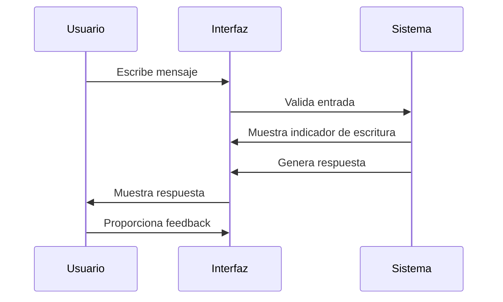

# Interfaz de Usuario - ChatNomina

## Descripción General
La interfaz de ChatNomina está diseñada para ser intuitiva y fácil de usar, permitiendo a los usuarios realizar consultas sobre nómina de manera eficiente.

## Componentes Principales

### 1. Barra de Navegación

- Logo de la aplicación
- Menú de navegación
- Botón de perfil de usuario
- Selector de tema (claro/oscuro)

### 2. Área de Chat

- Historial de conversación
  - Mensajes del usuario (derecha)
  - Respuestas del sistema (izquierda)
  - Timestamps
  - Indicadores de estado
- Campo de entrada de texto
  - Autocompletado
  - Sugerencias de preguntas
  - Botón de envío
- Botones de feedback
  - 👍 Respuesta útil
  - 👎 Respuesta incorrecta
  - 💬 Comentarios adicionales

### 3. Panel de Control

- Estado del sistema
  - Conexión
  - Carga de documentos
  - Estado de los modelos
- Acciones rápidas
  - Recargar documentos
  - Limpiar conversación
  - Exportar historial
- Información de sesión
  - Usuario actual
  - Tiempo de sesión
  - Última actualización

### 4. Panel de Ayuda

- Ejemplos de preguntas
- Categorías de consultas
- Guía rápida
- Enlaces a documentación

## Temas Visuales

### Tema Claro
- Fondo: Blanco (#FFFFFF)
- Texto: Gris oscuro (#333333)
- Acentos: Índigo (#3F51B5)
- Mensajes usuario: Azul claro (#E3F2FD)
- Mensajes sistema: Gris claro (#F5F5F5)

### Tema Oscuro
- Fondo: Gris oscuro (#121212)
- Texto: Blanco (#FFFFFF)
- Acentos: Índigo claro (#7986CB)
- Mensajes usuario: Azul oscuro (#1A237E)
- Mensajes sistema: Gris medio (#424242)

## Interacciones

### 1. Envío de Mensajes

### 2. Feedback
- Click en 👍: Marca respuesta como útil
- Click en 👎: Abre diálogo de feedback
- Click en 💬: Permite comentarios adicionales

### 3. Navegación
- Click en logo: Regresa al inicio
- Click en perfil: Muestra opciones de usuario
- Click en tema: Alterna entre claro/oscuro

## Accesibilidad

### 1. Atajos de Teclado
- `Ctrl + Enter`: Enviar mensaje
- `Ctrl + /`: Mostrar ayuda
- `Ctrl + B`: Alternar tema
- `Ctrl + L`: Limpiar conversación
- `Ctrl + E`: Exportar historial

### 2. Características de Accesibilidad
- Alto contraste
- Tamaños de texto ajustables
- Soporte para lectores de pantalla
- Navegación por teclado

## Responsive Design

### Desktop (>1200px)
- Panel lateral visible
- Chat a pantalla completa
- Múltiples columnas

### Tablet (768px - 1200px)
- Panel lateral colapsable
- Chat adaptativo
- Diseño en dos columnas

### Móvil (<768px)
- Panel lateral oculto
- Chat a pantalla completa
- Diseño en una columna

## Personalización

### 1. Ajustes de Usuario
- Tamaño de fuente
- Densidad de información
- Notificaciones
- Idioma

### 2. Preferencias de Chat
- Formato de fecha/hora
- Orden de mensajes
- Mostrar/ocultar timestamps
- Mostrar/ocultar avatares

## Solución de Problemas de Interfaz

### 1. Problemas de Visualización
- Limpiar caché del navegador
- Verificar resolución de pantalla
- Actualizar navegador
- Deshabilitar extensiones

### 2. Problemas de Interacción
- Verificar conexión
- Recargar página
- Cerrar sesión y volver a entrar
- Contactar soporte

## Mejores Prácticas

### 1. Uso Eficiente
- Usar atajos de teclado
- Mantener conversaciones organizadas
- Proporcionar feedback constructivo
- Exportar conversaciones importantes

### 2. Optimización
- Cerrar sesión al terminar
- Limpiar historial periódicamente
- Mantener navegador actualizado
- Usar conexión estable 