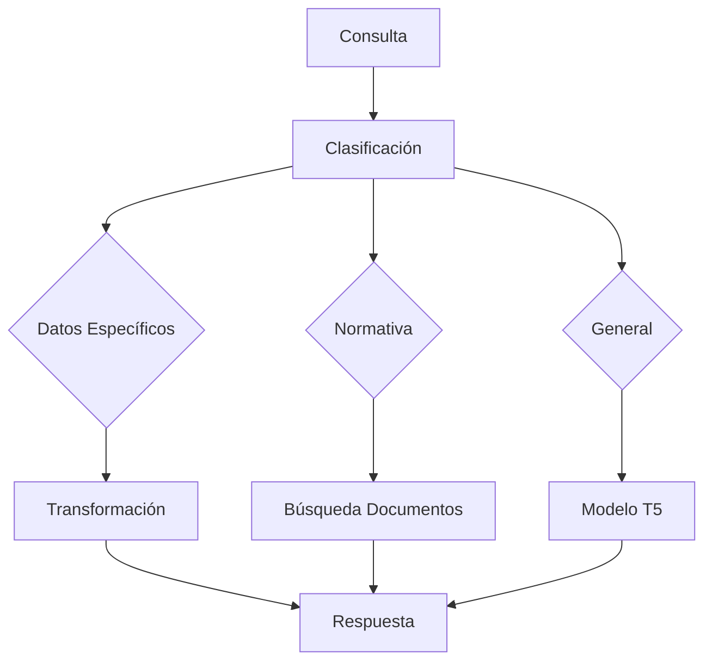

# Guía de Consultas - ChatNomina

## Tipos de Consultas Soportadas

### 1. Consultas de Datos Personales

#### Sueldo y Compensación
- "¿Cuál es mi sueldo actual?"
- "¿Cuánto he ganado este mes?"
- "¿Cuál es mi salario base?"
- "¿Cuáles son mis bonificaciones?"

#### Datos Bancarios
- "¿Cuál es mi cuenta bancaria?"
- "¿Dónde me consignan mi salario?"
- "¿Cuál es mi tipo de cuenta?"

#### Información Personal
- "¿Cuáles son mis datos personales?"
- "¿Cuál es mi fecha de ingreso?"
- "¿Cuál es mi cargo actual?"

### 2. Consultas de Nómina

#### Consignaciones
- "¿Cuál fue mi última consignación?"
- "¿Cuándo me pagaron el último salario?"
- "¿Cuál es el historial de mis pagos?"

#### Deducciones
- "¿Cuánto me retienen de salud?"
- "¿Cuál es mi retención en la fuente?"
- "¿Cuáles son mis descuentos actuales?"

#### Novedades
- "¿Cuáles son mis novedades este mes?"
- "¿Qué bonificaciones tengo pendientes?"
- "¿Cuáles son mis descuentos voluntarios?"

### 3. Consultas de Vacaciones

#### Días Disponibles
- "¿Cuántos días de vacaciones me quedan?"
- "¿Cuál es mi balance de vacaciones?"
- "¿Cuándo puedo tomar mis vacaciones?"

#### Historial
- "¿Cuándo tomé mis últimas vacaciones?"
- "¿Cuántos días he tomado este año?"
- "¿Cuál es mi historial de vacaciones?"

#### Políticas
- "¿Cuál es la política de vacaciones?"
- "¿Cómo solicito mis vacaciones?"
- "¿Cuántos días me corresponden por año?"

### 4. Consultas de Normativa

#### Leyes Laborales
- "¿Cuál es la normativa sobre horas extras?"
- "¿Qué dice la ley sobre primas?"
- "¿Cuáles son mis derechos laborales?"

#### Decretos
- "¿Cuál es el decreto sobre salarios?"
- "¿Qué dice el decreto sobre vacaciones?"
- "¿Cuál es la normativa de cesantías?"

#### Resoluciones
- "¿Cuál es la resolución sobre aportes?"
- "¿Qué dice la resolución sobre bonificaciones?"
- "¿Cuál es la normativa de descuentos?"

## Formato de Consultas

### 1. Estructura Recomendada
```
[Verbo] + [Sujeto] + [Complemento] + [Temporalidad]
```

Ejemplos:
- "¿Cuál es mi sueldo actual?"
- "¿Cuántos días de vacaciones me quedan para este año?"
- "¿Cuál fue el valor de mi última consignación?"

### 2. Palabras Clave
- Sueldo/Salario
- Vacaciones
- Consignación
- Retención
- Novedad
- Descuento
- Total
- Acumulado

### 3. Temporalidad
- Actual
- Este mes
- Este año
- Último
- Pendiente
- Próximo

## Mejores Prácticas

### 1. Formulación de Preguntas
- Ser específico
- Usar lenguaje claro
- Incluir fechas cuando sea relevante
- Evitar preguntas demasiado generales

### 2. Ejemplos de Preguntas Efectivas
✅ "¿Cuál es mi sueldo actual?"
✅ "¿Cuántos días de vacaciones me quedan para este año?"
✅ "¿Cuál fue el valor de mi última consignación?"
✅ "¿Cuál es la normativa sobre horas extras?"

### 3. Ejemplos de Preguntas a Evitar
❌ "Dime todo sobre mi nómina"
❌ "¿Qué hay de nuevo?"
❌ "Explícame todo sobre vacaciones"

## Procesamiento de Consultas

### 1. Flujo de Procesamiento


### 2. Tiempos de Respuesta
- Consultas simples: < 1 segundo
- Consultas con transformación: 1-3 segundos
- Consultas de normativa: 2-5 segundos
- Consultas complejas: 5-10 segundos

### 3. Manejo de Errores
- Consulta no reconocida
- Datos no disponibles
- Error de procesamiento
- Timeout

## Casos Especiales

### 1. Consultas Compuestas
- "¿Cuál es mi sueldo actual y cuánto me retienen?"
- "¿Cuántos días de vacaciones me quedan y cuándo las puedo tomar?"

### 2. Consultas con Fechas
- "¿Cuál fue mi sueldo en enero?"
- "¿Cuánto gané el año pasado?"
- "¿Cuáles fueron mis novedades en el último trimestre?"

### 3. Consultas Comparativas
- "¿Cómo ha variado mi sueldo este año?"
- "¿Cuánto más gané este mes comparado con el anterior?"
- "¿Cuál es la diferencia en mi retención este año?"

## Solución de Problemas

### 1. Consulta No Entendida
- Reformular la pregunta
- Usar palabras clave
- Simplificar la consulta
- Consultar ejemplos

### 2. Respuesta Incorrecta
- Verificar la pregunta
- Usar el sistema de feedback
- Consultar la documentación
- Contactar soporte

### 3. Sin Respuesta
- Verificar conexión
- Recargar la página
- Intentar más tarde
- Reportar el problema 